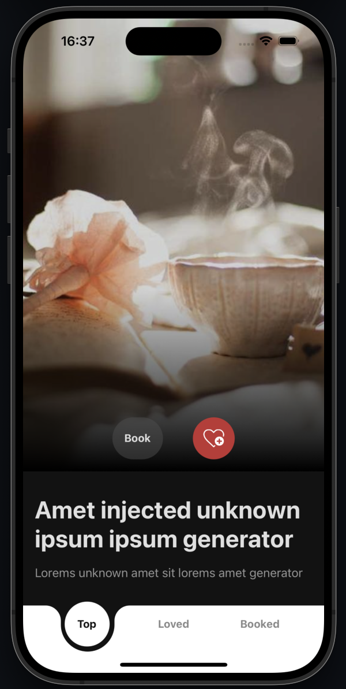
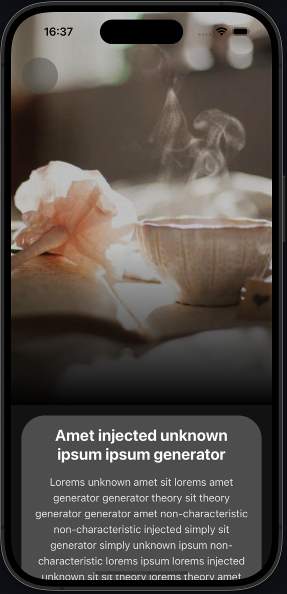

# Movie Booking Test

 

## 🌱 Prerequisites

Before running the project, ensure that you have the following installed:

- Node.js (version >= 18)
- React Native CLI
- Android SDK (for Android development)
- Xcode (for iOS development)

## ⚙️ Installation

1. Clone the repository:

```
git clone https://github.com/kazhoang/movie-booking.git && cd movie-booking
```

2. Install the project dependencies:

```
yarn
```

***

- For iOS, Install the CocoaPods dependencies:

```
yarn pod
```

> **Note:** Ensure that you have CocoaPods installed on your machine. If not, you can install it using:

> ```bash
> sudo gem install cocoapods
> ```

## Running the Application

### Android

```

yarn android

```

### IOS

```

yarn ios

```

## Project Structure

The project follows a standard React Native structure:

```bash
├── android
├── ios
└── src
    ├── components
    ├── navigators
    ├── screens
    ├── services
    ├── theme
    ├── types
    ├── utils
    └── App.tsx
```

## 📚 Dependencies

The project utilizes the following key dependencies:

| Library                             | Category         | Version | Description                                                                      |
| ----------------------------------- | ---------------- | ------- | -------------------------------------------------------------------------------- |
| React Native                        | Mobile Framework | v0.75   | Cross-platform mobile framework                                                  |
| React                               | UI Framework     | v18     | Popular UI framework                                                             |
| TypeScript                          | Language         | v5      | Static typechecking                                                              |
| React Navigation                    | Navigation       | v6      | Performant and consistent navigation framework                                   |
| React Native Reanimated             | UI               | v3      | Animations library for React Native                                              |
| React Native MMKV                   | Storage          | v2      | Key-value storage library for persisting application state                       |
| Detox                               | TestingLib       | v20     | End to End testing library                                                       |
| Redux                               | Storage          | v9      | State management library                                                         |

For a complete list of dependencies, refer to the `package.json` file.

## 🏗️ Development

### Detox Testing

Detox is utilized for end-to-end testing of the application. Below are the commands to build and test the application on both Android and iOS platforms.

#### Android

1. **Build**

   ```bash
   yarn detox:android:build
   ```

2. **Test**

   ```bash
   yarn detox:android:test
   ```

#### iOS

1. **Build**

   ```bash
   yarn detox:ios:build
   ```

2. **Test**

   ```bash
   yarn detox:ios:test
   ```

### Cleaning the Project

You can able to clean up the project with the following command

```
yarn clean
```
